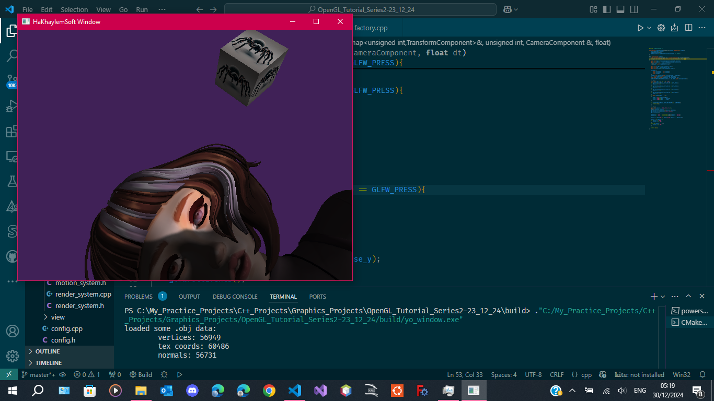
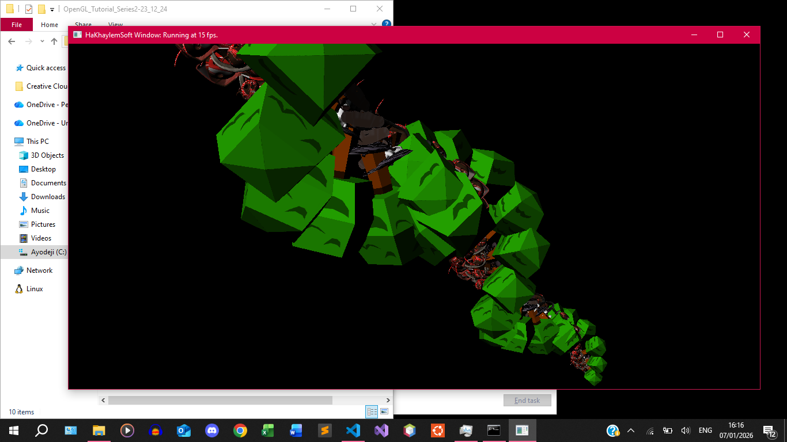
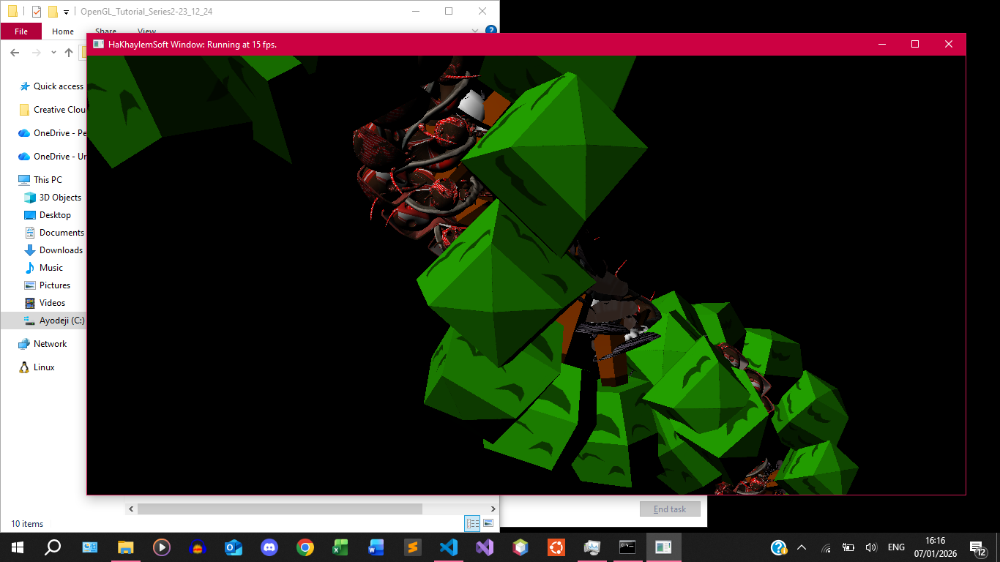
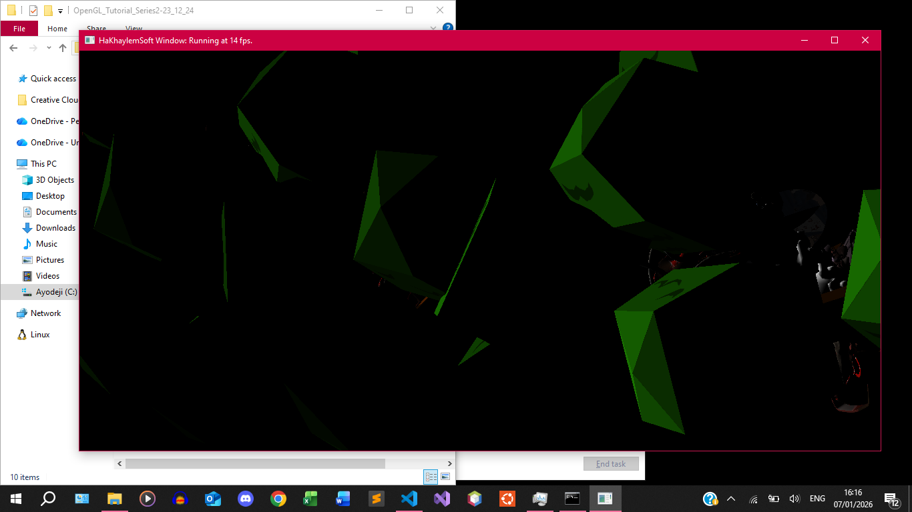
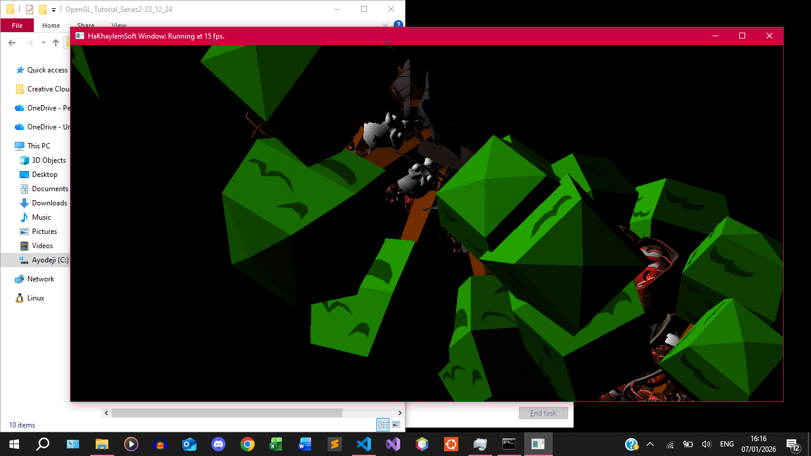
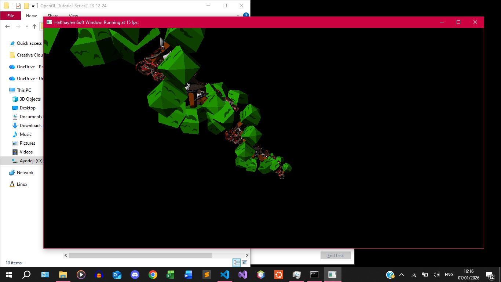

OpenGL_Tutorial_Series2-23_12_24

##   Overview

This is an OpenGL series from GetIntoGameDev on Youtube.

***Reference: GetIntoGameDev (2023), "OpenGL with C++ Series"***

###	How To Setup

1.  Clone repo.
2.  Open repo in a code editor such as VSCode (not Visual Studio)
3.  Install Cmake (Either as VSCode extension or manually)
4.  run `cmake ./core/CMakeLists.txt`
    -   Although, the CMake extension on VSCode should detect the `CMakeLists.txt` file automatically.
    -   This will download some dependencies into the `/core/_dependencies/` folder.
    -   It will then build the final `.exe` in the `/build/` folder it creates automatically.    
5.  Click `/core/src/main.cpp` to test the source version currently there.
6.  To test other source versions, copy the chosen episode's files into the `core` folder.
    -   By default, the `core` folder contains episode 14, "Image Arrays"

##  What You're Seeing Once You Run

For Episode 14's Image Arrays, you're seeing the instantiation of 1000 objects, each with their own textures.

You'll have to back up with the key "S" a but before you can see the structure.

###	Consider The Screenshots

